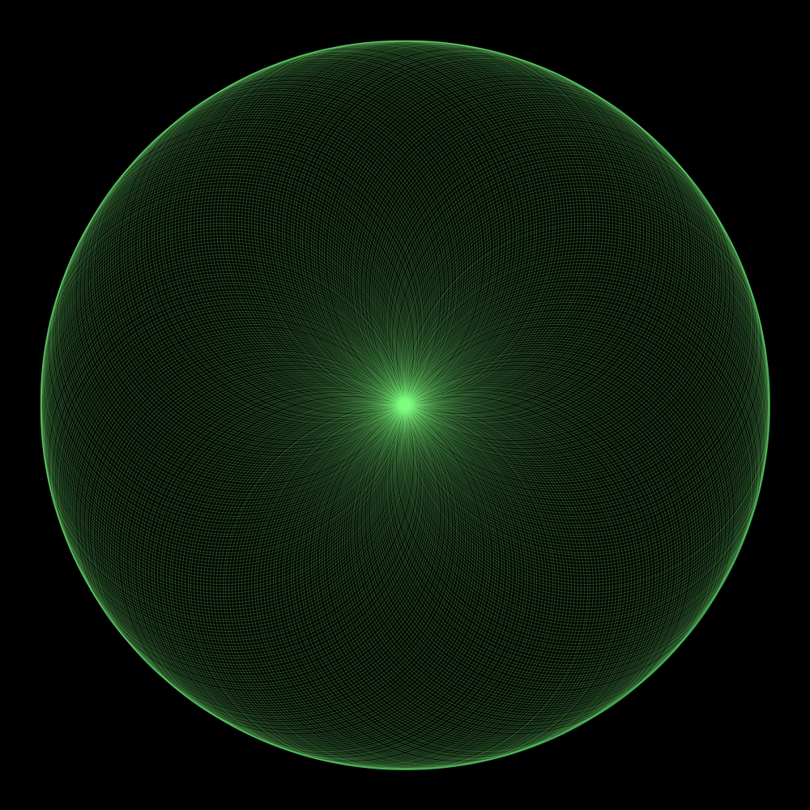
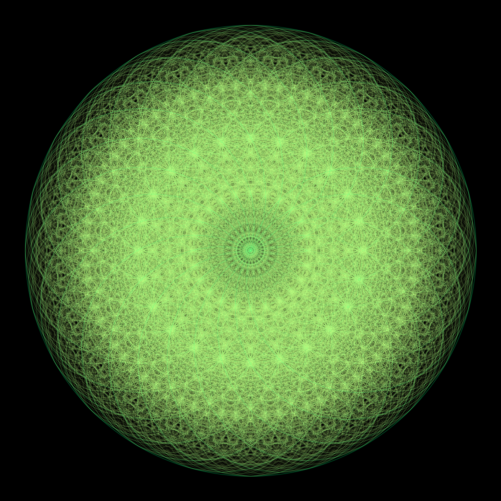
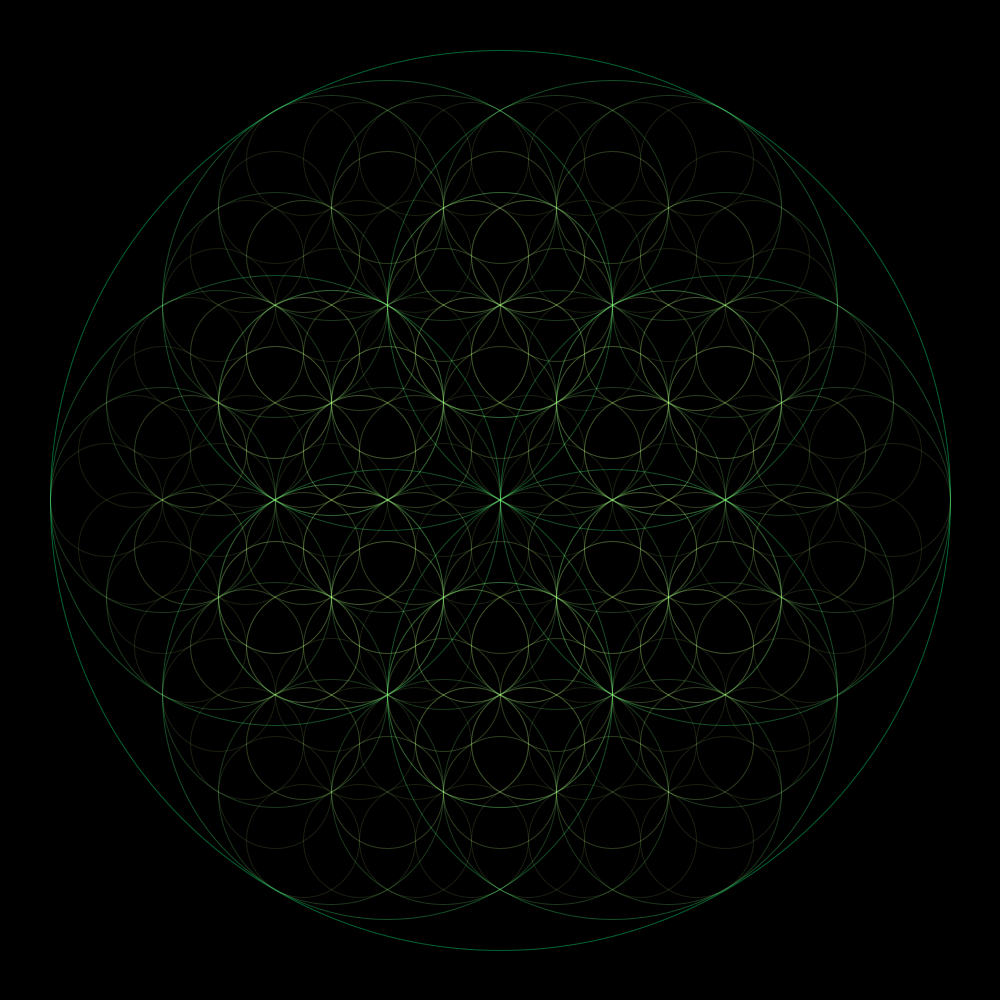
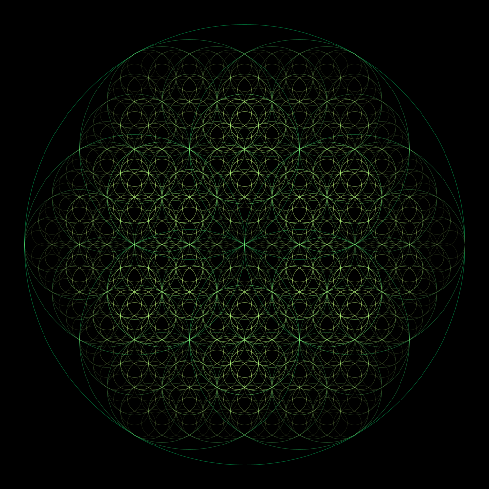

# Fractal1
A visual displaying of a simple fractal using recursive protocol

!ATTENTION: this code was written using Processing Java, go to the link below and download the program for running the program smoothly. I've uploaded uploaded some pictures to show the program
 <a href="processing.org">processing.org</a>

 
You can use the following keyboard buttons in the program:
  <ul>
<li>UP arrow : increase iteration number</li>
<li>DOWN arrow : decrease iteration number</li>
<li>RIGHT arrow : increase rotation degree by 1</li>
<li>LEFT arrow : decrease rotation degree by 1</li>
<li>Mouse Click : Save a 1000x1000 pixel image in .png</li>
    </ul>

<table>
  <tr>
    <td></td>
    <td></td>
  </tr>
  <tr>
    <td></td>
    <td></td>
  </tr>
</table>
